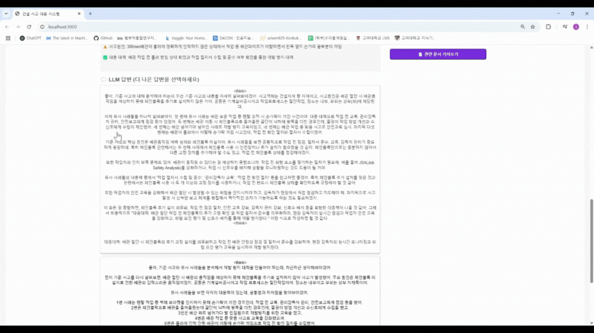
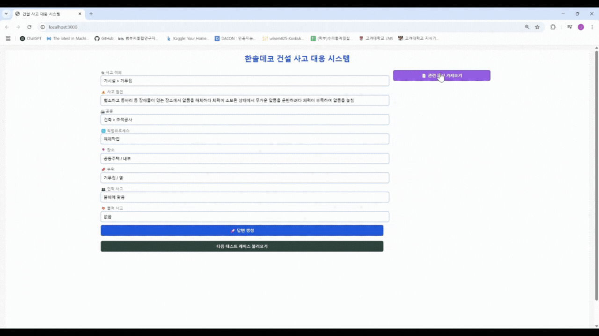

# 🚀 한솔데코 건설 사고 대응 시스템

[](https://www.python.org/)
[](https://fastapi.tiangolo.com/)
[-cyan.svg)](https://reactjs.org/)
[](https://github.com/facebookresearch/faiss)
[](https://ollama.com)
[](https://www.docker.com/)
[](https://opensource.org/licenses/MIT)

**건설 현장의 과거 사고 사례(`database.csv`)를 기반으로, FAISS를 이용한 빠른 유사 사례 검색과 로컬 LLM을 활용하여 최적의 대응 방안을 제안합니다. 이 답변을 기반으로 사용자 피드백(`responses.jsonl`)을 통해 Human Feedback이 된 높은 품질의 데이터 베이스 구축을 목표로 하는 프로젝트입니다.**

* 실제 제출에 사용한 코드와 설명 -> [코드 설명과 ipynb파일](https://github.com/Mutoy-choi/dacon_hansol3/tree/main/IpynbCode)

* 서면 평가 자료 -> [서면 평가 자료 PDF파일](https://github.com/Mutoy-choi/dacon_hansol3/blob/main/%EB%8F%84%EB%A9%94%EC%9D%B8%20%ED%8A%B9%ED%99%94%20%ED%8F%89%EA%B0%80%20%EC%A7%80%ED%91%9C%EB%A5%BC%20%ED%99%9C%EC%9A%A9%ED%95%9C%20%EA%B1%B4%EC%84%A4%20%EC%82%AC%EA%B3%A0%20%EB%8C%80%EC%9D%91%20%EC%8B%9C%EC%8A%A4%ED%85%9C%20%EA%B0%9C%EB%B0%9C_%ED%8C%80%20AIDA.pdf)

---

**목차**
1.  [프로젝트 개요](#1-프로젝트-개요)
2.  [주요 특징](#2-주요-특징)
3.  [데모 시연](#3-데모-시연)
    *   [LLM 기반 대응 방안 생성](#llm-기반-대응-방안-생성)
    *   [사용자 선택 및 수정](#사용자-선택-및-수정)
    *   [건설안전지침 등 문서 조회](#건설안전지침-등-문서-조회)
4.  [시스템 아키텍처](#4-시스템-아키텍처)
5.  [구성 요소](#5-구성-요소)
6.  [사전 요구 사항](#6-사전-요구-사항)
7.  [설치 및 실행 방법](#7-설치-및-실행-방법)
    *   [1. 소스 코드 복제](#1-소스-코드-복제)
    *   [2. 데이터 및 RAG DB 준비 (필수)](#2-데이터-및-rag-db-준비-필수)
    *   [3. Docker Compose로 실행하기 (권장)](#3-docker-compose로-실행하기-권장)
    *   [4. 로컬 환경에서 직접 실행하기](#4-로컬-환경에서-직접-실행하기)
8.  [주요 스크립트 설명](#8-주요-스크립트-설명)
9.  [파일 구조](#9-파일-구조)
10. [향후 개선 방향](#10-향후-개선-방향)
11. [라이선스](#11-라이선스)

---

## 1. 프로젝트 개요

#### 본 프로젝트는 **RAG (Retrieval-Augmented Generation)** 아키텍처를 기반으로 건설 현장 사고 발생 데이터 기반으로 높은 퀄리티의 데이터 베이스의 구축을 목표로 구상된 데모입니다. 

사용자가 **사고의 주요 내용(객체, 원인 등)** 을 입력하면 혹은 테스트 데이터를 불러오면, 시스템은 먼저 FAISS를 이용하여 `database.csv`에 저장된 방대한 **과거 유사 사고 사례** 중 관련성이 높은 내용을 효율적으로 검색합니다.

검색된 사례와 사용자 입력을 바탕으로, 로컬 환경에서 구동되는 **LLM**이 문맥을 이해하고 **두 가지 초기 대응 방안**을 생성하여 사용자에게 제시합니다. 사용자는 두 방안을 비교 검토 후 **더 적절한 방안을 선택**하거나, 필요에 따라 **직접 내용을 수정**하여 최적의 대응 방안을 확정할 수 있습니다.

이 과정에서 사용자의 선택 및 수정 내용은 `responses.jsonl` 파일에 **JSON Lines 형식으로 기록**되어 축적됩니다. 이 데이터는 향후 다양한 Human Feedback이 필요한 **강화학습** (RLHF, DPO, GRPO)방식으로 LLM 모델을 파인튜닝하거나 RAG 시스템 자체를 개선하는 데 활용될 수 있습니다. 또한, 사용자는 대응 방안 검토 중 관련 **건설안전 지침 문서를 시스템 내에서 즉시 조회**하여 참고할 수 있습니다.

---

## 2. 주요 특징

*   **RAG 기반 지능형 대응**: 과거 데이터(DB) 검색과 LLM 생성을 결합하여 현실적이고 맥락에 맞는 대응 방안 제공.
*   **듀얼 답변 제시 및 사용자 피드백**: 두 가지 대응 방안 옵션 제공 및 사용자 선택/수정 기능을 통한 Human Feedback 데이터 확보 (`responses.jsonl`).
*   **로컬 LLM 활용 (Ollama)**: 데이터 프라이버시를 보호하고 외부 API 비용 없이 강력한 LLM 기능 활용.
*   **데이터 관리 스크립트**: RAG DB 구축(`buildRAGdb.py`), 업데이트(`updateRAG.py`), 정리(`cleanDB.py`)를 위한 유틸리티 스크립트.
*   **참고 문서 접근성**: 시스템 내에서 관련 건설 안전 지침 문서 즉시 조회 기능.

---

## 3. 데모 시연

### LLM 기반 대응 방안 생성
*   사고 정보 입력 시, 백엔드가 FAISS로 유사 사례 검색 후 Ollama에 질의하여 **2가지 대응 방안**을 생성, 프론트엔드로 전달합니다.
    

### 사용자 선택 및 수정
*   프론트엔드에서 사용자에게 두 가지 대응 방안을 비교하여 보여줍니다.
*   사용자는 **더 나은 답변**을 선택하거나, **직접 답변을 편집**하여 최종안을 확정하고 저장 (`responses.jsonl`에 기록)할 수 있습니다.
    

### 건설안전지침 등 문서 조회
*   대응 방안 검토 중 추가 정보가 필요할 경우, 연동된 **건설안전지침** 문서를 검색하고 내용을 확인할 수 있습니다.
    

---

## 4. 시스템 아키텍처

```
+-------------------------+       +---------------------------+       +-----------------------------+
|   Frontend (React/Vite) | <---->|    Backend (FastAPI)      | <---->|    LLM Engine               |
|   (Port 3000)           |       |    (Port 8000)            |       | [Ollama (Dev/Default)]      |
|   - User Input          |       |    - API Endpoints        |       | [vLLM (Serving Option)]     |
|   - Display Responses   |       |    - Accident Search      |       | - Text Generation API       |
|   - User Feedback       |       |    - Guideline Search     |       +-----------------------------+
|   - Document Viewer     |       |    - LLM API Interaction  |                ^
+-------------------------+       |    - Feedback Logging     |                |
                                  +---------------------------+                |
                                     |    ^         |                          |
 +-----------------------------------+    |         +--------------------------+
 |                                        |                          
 v                                        |                          
+-----------------------------+ +----------------------+    +--------------------------+
| Accident Case Embeddings    | |   Guideline Index    |    | User Feedback            |
|(backend/vectorized_data.npz)| | (backend/faiss_index)|    | (backend/responses.jsonl)|
+-----------------------------+ +----------------------+    +--------------------------+
           ^                                ^
           |                                |
+--------------------------+    +----------------------+
|   Raw Accident Data      |    | Raw Guideline Data   |
|(backend/database.csv)    |    |    (buildRAGdb.py)   |
+--------------------------+    +----------------------+
```

**워크플로우:**

1.  **사용자**는 프론트엔드(React/Vite)를 통해 사고 정보(객체, 원인 등)를 입력합니다.
2.  **프론트엔드**는 입력된 정보를 백엔드 API(FastAPI)로 전송합니다.
3.  **백엔드**는 `vectorized_data.npz` (사전에 `database.csv`로부터 계산된 임베딩)를 사용하여 입력 정보와 **유사한 과거 사고 사례**를 검색합니다.
4.  **백엔드**는 검색된 사고 사례와 사용자 입력을 조합하여, 설정된 LLM 엔진 (현재 기본값: Ollama)에 두 가지 대응 방안 생성을 요청합니다.
5.  **LLM 엔진**은 텍스트를 생성하여 **백엔드**로 반환합니다.
6.  **백엔드**는 생성된 두 방안을 **프론트엔드**로 전달합니다.
7.  **프론트엔드**는 사용자에게 두 방안을 제시하고, 사용자는 더 나은 방안을 선택하거나 직접 수정하여 피드백을 제공합니다.
8.  **프론트엔드**는 사용자 피드백(선택/수정 내용)을 **백엔드**로 전송합니다.
9.  **백엔드**는 수신된 피드백을 `responses.jsonl` 파일에 기록합니다.
10. (별도 기능) 사용자가 **건설안전지침 문서** 조회를 요청하면, **백엔드**는 `backend/faiss_index/` (사전에 안전지침 문서로 구축된 FAISS 인덱스)를 사용하여 관련 내용을 검색하고 **프론트엔드**에 제공합니다.

* 아키텍처의 **LLM 엔진** 부분은 데모 단계에서는 개발의 편의성을 위해 Ollama를 기본으로 사용하지만, 실제 고성능 서빙 환경(예: 한솔데코 A100 서버)에서는 vLLM으로 교체하여 운영해야합니다.

## 5. 구성 요소

1.  **백엔드**
    *   **프레임워크**: [FastAPI](https://fastapi.tiangolo.com/) (Python 3.12+)
    *   **포트**: `8000`
    *   **주요 역할**:
        *   API 엔드포인트 제공 (사고 정보 수신, 대응 방안 반환, 피드백 저장, 문서 조회)
        *   RAG 데이터베이스 관리:
            *   원본 데이터 로드 (`database.csv`).
            *   텍스트 임베딩 생성 (e.g., `ibm-granite/granite-embedding-107m-multilingual` 사용, `buildRAGdb.py`).
            *   FAISS 인덱스 생성 및 관리 (`backend/faiss_index/`, `buildRAGdb.py`, `updateRAG.py`).
        *   유사도 검색: FAISS 인덱스를 활용한 빠른 검색 수행.
        *   Ollama API 연동: 로컬 LLM 호출 및 응답 처리.
        *   사용자 피드백 로깅: 선택/수정된 결과를 `responses.jsonl`에 저장.
    *   **주요 파일**: `main.py`, `buildRAGdb.py`, `updateRAG.py`, `cleanDB.py`, `requirements.txt`, `database.csv`, `responses.jsonl`, `faiss_index/`

2.  **프론트엔드**
    *   **프레임워크/라이브러리**: [React](https://reactjs.org/)
    *   **빌드 도구**: [Vite](https://vitejs.dev/)
    *   **포트**: `3000`
    *   **주요 역할**:
        *   사용자 인터페이스 제공 (사고 정보 입력, 결과 표시).
        *   백엔드 API 통신 (`api.js`).
        *   LLM 생성 대응 방안 표시 및 사용자 인터랙션 (선택, 편집).
        *   사용자 피드백 백엔드 전송.
        *   관련 문서 조회 기능.
    *   **주요 파일**: `App.jsx`, `main.jsx`, `api.js`, `vite.config.js`, `package.json`

3.  **LLM**
    *   **소프트웨어**: [Ollama](https://ollama.com)
    *   **역할**: 로컬 LLM 실행 및 관리, 백엔드의 텍스트 생성 요청 처리.
    *   **모델**: `qwq` (또는 필요에 따라 다른 모델 사용 가능).
    *   **하드웨어 가속**: NVIDIA GPU환경에서 CUDA를 통해 가속 지원.
    *   **모델 캐시**: Docker 볼륨(`ollama_data`) 또는 로컬 경로(`~/.ollama`)에 모델 파일 저장.

4.  **데이터 및 인덱스**
    *   `backend/database.csv`: RAG의 기반이 되는 원본 사고 사례 데이터.
    *   `backend/vectorized_data.npz` : train.csv(원본 사고 사례 데이터)를 벡터화시켜 저장한 데이터.
    *   `backend/faiss_index/`: `buildRAGdb.py`를 통해 생성된 건설안전지침 FAISS 인덱스 파일 저장 디렉토리. 빠른 유사도 검색에 사용됨.
    *   `backend/responses.jsonl`: 사용자가 선택하거나 수정한 대응 방안이 기록되는 파일 (JSON Lines 형식).

---

## 6. 사전 요구 사항

*   **운영체제**: Ubuntu 24.04 (테스트 및 개발 환경 기준)
*   **GPU**: VRAM 20GB이상의 NVIDIA GPU  - Ollama 및 FAISS-GPU 가속을 위해 필요.
*   **NVIDIA 드라이버 & CUDA Toolkit**: GPU 사용을 위한 드라이버 및 FAISS/PyTorch와 호환되는 CUDA 버전 설치 필요.
*   **Python**: 버전 3.12 이상.

---

## 7. 설치 및 실행 방법

### 1. 소스 코드 복제
```bash
git clone https://github.com/Mutoy-choi/dacon_hansol3
```

### 2. 데이터 및 RAG DB 준비 (필수)

FastAPI 백엔드가 유사 사례를 검색하기 위해 **사고 사례 임베딩 데이터(`vectorized_data.npz`)** 와 **건설안전지침 FAISS 인덱스**가 필요합니다.

**A. 사고 사례 임베딩 데이터 (`vectorized_data.npz`) 준비:**

이 파일은 `database.csv`(`train.csv`)의 사고 사례 정보를 벡터화하여 저장한 것입니다. 다음 **두 가지 방법 중 하나**를 선택하여 준비합니다.

*   **방법 1 (다운로드):**
    1.  [여기](https://drive.google.com/file/d/1TgNFsKpii-SGkkxd6Rd7MLXWJuJ2NZQn/view?usp=drive_link)에서 `vectorized_data.npz` 파일을 다운로드합니다.
    2.  다운로드한 파일을 프로젝트 내의 `backend/` 디렉토리로 이동시킵니다.

*   **방법 2 (직접 생성):**
    1.  백엔드 디렉토리로 이동하여 필요한 라이브러리를 설치합니다.
        ```bash
        cd backend
        pip install -r requirements.txt
        cd ..
        ```
    2.  `precompute_vectors.py` 스크립트를 실행합니다.
        ```bash
        python precompute_vectors.py
        ```
        *   **주의:** 이 스크립트는 `database.csv`를 읽어 `ibm-granite/granite-embedding-107m-multilingual` 모델로 임베딩을 생성합니다. **GPU 환경이 권장**되며, 모델 다운로드 및 임베딩 생성에 상당한 시간이 소요될 수 있습니다.

**B. 건설안전지침 FAISS 인덱스 생성:**

건설안전지침 PDF파일이 담긴 폴더를 디렉토리에 저장 후, 다음 스크립트를 실행하여 인덱스를 생성합니다.

1.  **백엔드 디렉토리로 이동**:
    ```bash
    cd backend
    ```
2.  **(로컬 실행 시) 가상 환경 생성 및 활성화 (권장)**:
    ```bash
    # 이미 생성했다면 source venv/bin/activate 또는 venv\Scripts\activate 실행
    # 생성하지 않았다면:
    python -m venv venv
    source venv/bin/activate # Linux/macOS
    # venv\Scripts\activate # Windows
    ```
3.  **필요 패키지 설치 (이미 했다면 건너뛰기)**:
    ```bash
    pip install -r requirements.txt
    ```
4.  **FAISS 인덱스 생성**:
    ```bash
    python buildRAGdb.py
    ```
    *   이 스크립트는 건설안전지침 관련 데이터를 임베딩하고 `faiss_index/` 디렉토리에 FAISS 인덱스 파일 및 DB 관련 csv파일을 생성합니다.
    *   GPU 사용 시 더 빠르게 완료됩니다.
5.  **데이터 정제 및 업데이트:** 필요시 `cleanDB.py`를 사용하여 `faiss_index/metadata.csv`를 전처리할 수 있습니다. (실행 전 `buildRAGdb.py` 실행 필요, 이후 `updateRAG.py`로 FAISS 인덱스 업데이트가 가능합니다.)
6.  **프로젝트 루트 디렉토리로 복귀**:
    ```bash
    cd ..
    ```
### 3. Docker Compose로 실행하기 (권장)

Docker를 사용하면 모든 구성 요소를 격리된 환경에서 쉽게 실행할 수 있습니다.

1.  **(최초 실행 시) Ollama 모델 다운로드**:
    호스트 머신에 Ollama가 설치되어 있다면 미리 모델을 받아두는 것이 좋습니다. Docker 볼륨을 통해 공유됩니다.
    ```bash
    # 호스트 터미널에서 실행
    ollama pull qwq
    ```
    또는 Docker Compose 실행 후 컨테이너 내에서 다운로드:
    ```bash
    # docker-compose up --build 실행 후 새 터미널에서
    docker exec -it <ollama_container_name> ollama pull qwq
    ```

2.  **Docker Compose 빌드 및 실행**:
    ```bash
    # 프로젝트 루트 디렉토리에서 실행
    docker-compose up --build
    ```
    *   `--build`: 이미지 변경 사항이 있거나 처음 실행할 때 이미지를 빌드합니다.
    *   `-d`: 백그라운드에서 실행하려면 `-d` 옵션을 추가합니다.

3.  **서비스 접속**:
    *   **프론트엔드**: `http://localhost:3000`
    *   **백엔드 API 문서 (Swagger UI)**: `http://localhost:8000/docs`

4.  **종료**:
    ```bash
    # 포그라운드 실행 중이면 Ctrl+C
    # 백그라운드 실행 중이거나 별도 종료 시
    docker-compose down
    ```
    *   볼륨(`ollama_data` 등)까지 삭제하려면 `docker-compose down -v` 실행.

### 4. 로컬 환경에서 직접 실행하기

각 서비스를 로컬 머신에서 직접 실행합니다. **사전 요구 사항** 및 **데이터 준비** 단계가 완료되었다고 가정합니다.

1.  **Ollama 서비스 실행**:
    *   Ollama가 설치되어 있는지 확인하고 서비스를 시작합니다. (보통 백그라운드 서비스로 실행됨)
    *   필요한 모델(`qwq`)이 다운로드되었는지 확인합니다 (`ollama list`).

2.  **백엔드 실행 (터미널 1)**:
    ```bash
    cd backend
    source venv/bin/activate # 가상 환경 활성화 (생성했다면)
    # FAISS 인덱스 (faiss_index/) 및 responses.jsonl 파일이 있는지 확인
    uvicorn main:app --host 0.0.0.0 --port 8000 --reload
    ```

3.  **프론트엔드 실행 (터미널 2)**:
    ```bash
    cd frontend
    npm install # 또는 yarn install (최초 실행 시)
    npm run dev  # Vite 개발 서버 시작 (Create React App의 npm start 대신)
    ```

4.  **서비스 접속**:
    *   **프론트엔드**: `http://localhost:3000` (Vite가 다른 포트를 제안할 수도 있음)
    *   **백엔드 API**: `http://localhost:8000`

---

## 8. 주요 스크립트 설명

*   `buildRAGdb.py`: `database.csv`의 데이터를 기반으로 텍스트 임베딩을 계산하고 FAISS 인덱스를 생성하여 `backend/faiss_index/`에 저장합니다. RAG 시스템의 건설안전지침 검색 데이터베이스를 구축하는 핵심 스크립트입니다.
*   `precompute_vectors.py`: train.csv를 사용하여 벡터화 된 train.csv데이터를 생성하고 저장합니다. RAG 시스템의 실제 생성에서의 검색 데이터베이스를 구축하는 핵심 스크립트입니다.
*   `updateRAG.py`: 정제하여 metadata.csv에 저장된 데이터를(`faiss_index/metadata.csv`에 추가된 내용)를 기존 FAISS 인덱스에 업데이트하는 기능을 수행합니다다.
*   `cleanDB.py`: `faiss_index/metadata.csv`의 데이터를 정제합니다.
*   `testRAG.py`: 구현된 RAG 파이프라인(유사도 검색 + LLM 응답 생성)이 예상대로 작동하는지 테스트합니다.

---

## 9. 파일 구조

```
.
├── backend/                  # FastAPI 백엔드
│   ├── __pycache__/         # Python 캐시 폴더 (Git 무시됨)
│   ├── faiss_index/         # FAISS 인덱스 파일 저장 디렉토리
│   ├── Dockerfile           # 백엔드 Docker 이미지 빌드 설정
│   ├── database.csv         # 원본 사고 사례 데이터
│   ├── faiss_index.zip      # (선택적) FAISS 인덱스 압축 파일
│   ├── logs.txt             # 로그 파일
│   ├── main.py              # FastAPI 메인 애플리케이션
│   ├── requirements.txt     # Python 의존성 목록
│   ├── responses.jsonl      # 사용자 피드백 저장 파일 (JSON Lines)
│   └── test.csv             # 테스트용 데이터
│
├── demo_gif/                 # 데모 시연용 GIF 파일
│   ├── 관련문서가져오기.gif
│   ├── 답변생성.gif
│   └── 답변수정.gif
│
├── frontend/                 # React/Vite 프론트엔드
│   ├── public/              # 정적 파일 폴더
│   ├── src/                 # React 소스 코드
│   │   ├── App.jsx          # 메인 애플리케이션 컴포넌트
│   │   ├── api.js           # 백엔드 API 통신 로직
│   │   ├── index.css        # 전역 CSS 스타일
│   │   └── main.jsx         # React 앱 진입점
│   ├── Dockerfile           # 프론트엔드 Docker 이미지 빌드 설정
│   ├── index.html           # HTML 템플릿 (Vite 진입점)
│   ├── package-lock.json    # npm 의존성 잠금 파일
│   ├── package.json         # Node.js 프로젝트 및 의존성 정의
│   └── vite.config.js       # Vite 설정 파일
│
├── .gitignore                # Git 추적 제외 목록
├── README.md                 # 프로젝트 설명 파일 (현재 파일)
├── buildRAGdb.py             # LLM키워드 추출을 사용한 RAG DB (FAISS 인덱스) 빌드 스크립트
├── cleanDB.py                # 데이터 정제 스크립트
├── docker-compose.yml        # Docker Compose 설정 파일
├── precompute_vectors.py     # 벡터DB구성 관련 스크립트
├── testRAG.py                # RAG 기능 테스트 스크립트
└── updateRAG.py              # RAG DB 업데이트 스크립트
```

---

## 10. 향후 개선 방향

현재 시스템은 **신속한 프로토타이핑과 개발 유연성 확보**를 위해 **Ollama**를 LLM 엔진으로 사용하고 있습니다. 이는 다양한 아이디어를 빠르게 검증하고 RAG 파이프라인의 핵심 로직을 구축하는 데 효과적이었습니다.

향후 시스템이 안정화되고 실제 운영 환경에 배포될 때, 다음과 같은 방향으로 개선을 진행할 계획입니다.

1.  **프로덕션 환경 성능 최적화 (vLLM 도입)**:
    *   현재 구축된 RAG 및 피드백 파이프라인이 완성되고 안정화되면, **실제 서비스 환경(예: 한솔데코 A100 인프라)에서의 처리량과 응답 속도를 극대화**하기 위해 LLM 엔진을 **vLLM으로 전환**합니다.
    *   이를 통해 Ollama 대비 월등히 높은 성능을 확보하고, 다수의 동시 사용자 요청을 효율적으로 처리하는 것을 목표로 합니다. 이 과정에는 해당 인프라에 맞는 vLLM 서버 설정 및 관리가 포함됩니다.

2.  **사용자 피드백 기반 시스템 진화 (RLHF 파이프라인 구축)**:
    *   `responses.jsonl`에 축적되는 사용자 피드백 데이터를 활용하여 **지속적으로 시스템 성능을 개선**하는 파이프라인을 구축합니다.
    *   단기적으로는 피드백 데이터를 분석하여 프롬프트 엔지니어링을 개선하거나 RAG 검색 로직을 조정할 수 있습니다.
    *   장기적으로는 이 데이터를 사용하여 **LLM 모델을 파인튜닝**하거나, RAG 시스템 자체를 평가하고 개선하는 **자동화된 RLHF 유사 프로세스**를 구현하는 것을 목표로 합니다.

3.  **데이터 관리 효율화 (DB 시스템 도입)**:
    *   현재 파일 기반(`database.csv`, `responses.jsonl`, `vectorized_data.npz`)으로 관리되는 데이터를 데이터베이스 시스템(예: PostgreSQL + pgvector, MongoDB 등)으로 전환합니다.
    *   이를 통해 데이터의 **확장성, 검색 효율성, 관리 용이성**을 높이고, 더 복잡한 데이터 처리 및 분석 기능을 구현할 기반을 마련합니다.

---

## 11. 라이선스

이 프로젝트는 [MIT 라이선스](LICENSE) 하에 배포됩니다. 자세한 내용은 프로젝트 루트의 `LICENSE` 파일을 참조하십시오.

다음과 같은 주요 오픈소스 기술 및 모델을 활용하여 개발되었습니다. 각 컴포넌트의 라이선스를 확인하고 준수하는 것은 사용자의 책임입니다.

*   **프레임워크/라이브러리:**
    *   FastAPI ([MIT License](https://github.com/tiangolo/fastapi/blob/master/LICENSE))
    *   React ([MIT License](https://github.com/facebook/react/blob/main/LICENSE))
    *   Vite ([MIT License](https://github.com/vitejs/vite/blob/main/LICENSE))
    *   FAISS ([MIT License](https://github.com/facebookresearch/faiss/blob/main/LICENSE))
*   **LLM 실행 도구:**
    *   Ollama ([MIT License](https://github.com/ollama/ollama/blob/main/LICENSE)) - 로컬 LLM 실행 및 관리 도구
*   **사용된 LLM 모델:**
    *   **Qwen/QwQ-32B**:
        *   **라이선스:** Apache 2.0 License
        *   **출처/정보:** [https://huggingface.co/Qwen/QwQ-32B](https://huggingface.co/Qwen/QwQ-32B)
*   **사용된 임베딩 모델:**
    *   **`ibm-granite/granite-embedding-107m-multilingual`**:
        *   **라이선스:** Apache 2.0 License
        *   **출처/정보:** [https://huggingface.co/ibm-granite/granite-embedding-107m-multilingual](https://huggingface.co/ibm-granite/granite-embedding-107m-multilingual)
